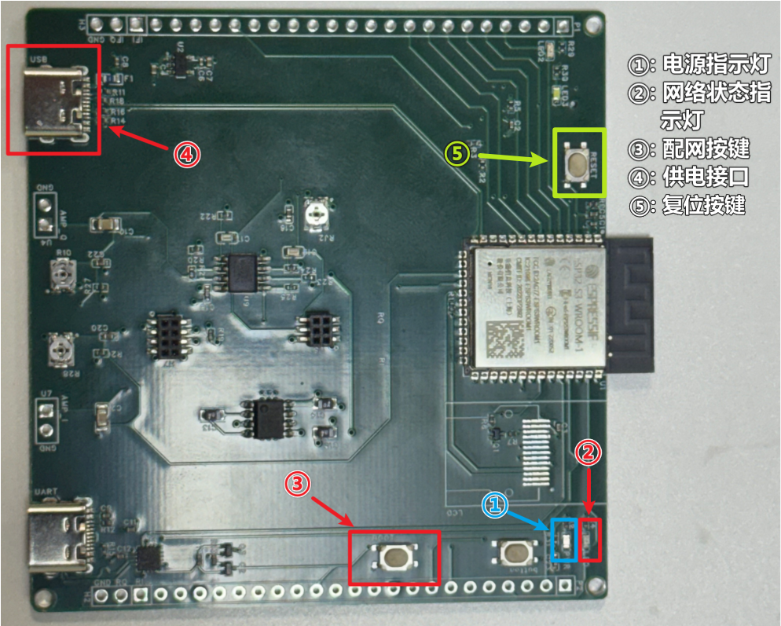
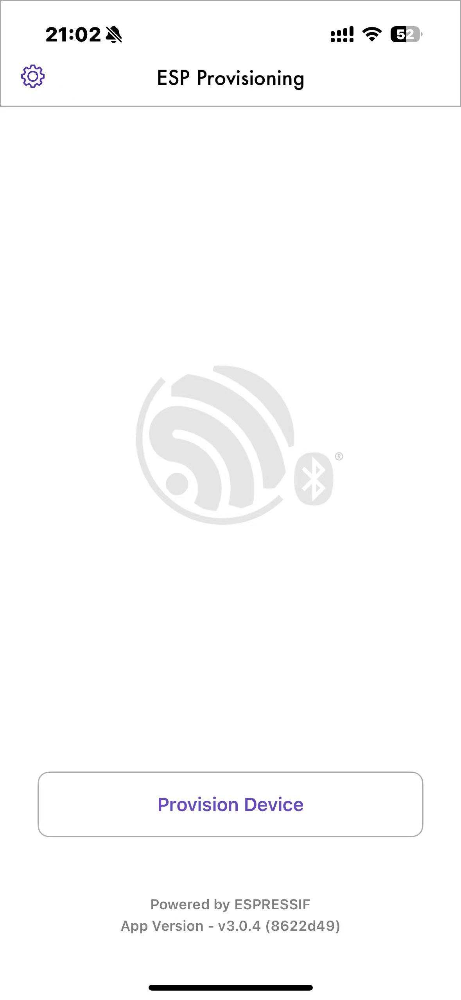
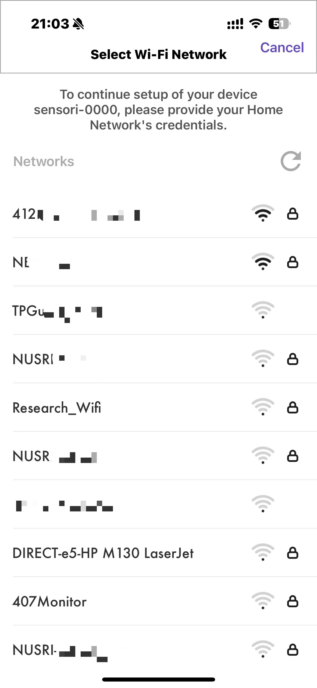
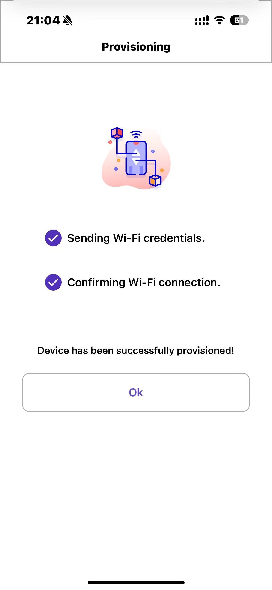
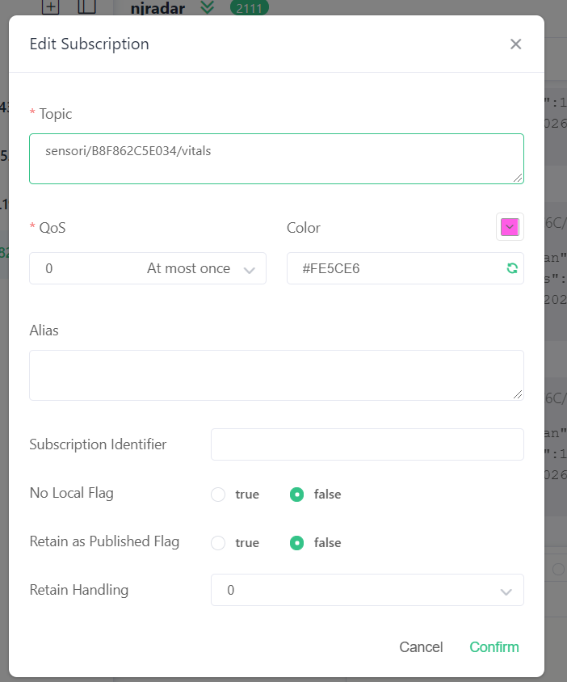

# 在床检测模块

> v3.0
> 浏览器可能会缓存旧网页，建议使用`Shift+F5`强制刷新网页，以获取最新文档。

---

## 1. 模块介绍


- **LED指示灯**：
  -  **① 电源指示灯**
    - 蓝色，模块供电正常时常亮
  - **② 网络状态指示灯**
    - 红色，WiFi连接正常时慢闪（1Hz）；WiFi连接出错时常灭；进入配网模式时快闪
  -  指示灯的颜色和位置可在后续工作中优化
- **④ 供电接口**
  - Type-c类型，要求**输入5v**。**通电后设备自动运行**。
- **⑤ 复位按键**
  - 按下并松开后系统重启。
- **配网按键**

---

## 2. 配网流程及示意图

**0）手机上安装ESP BLE Prov**


**1）给模块<u>供电</u>**

**2）网络状态指示灯（红灯）快闪，表明为配网模式**

- 如果不在配网模式，可长按配网按键，直至网络状态指示灯快闪。

**3）打开ESP BLE Prov**



**4）点击Provision Device**

**5）扫描板子背面的二维码**


**6）连接WiFi**






**7）等待网络状态指示灯（红灯）慢闪，表示模块已连上WiFi**

​	若WiFi指示灯常灭，则摁一下模块复位按键等待几秒，如若WiFi指示灯仍没有慢闪，则可能是连接的Wifi有问题，可尝试连接其他WiFi。

---

## 2. 模块的输出（主题与报文）

- 主题：`/sensori/{node_id}/vitals`  （例如` /sensori/B8F862C5E034/vitals`，node_id现已贴于板子背面）
- 报文（JSON）中可关注项如下：
  - `Status`：状态结果，整型。
    - `0`，无人；
    - `1`，有人，处于静止状态；
    - `2`， 有人，处于运动状态。
  - `HR`：心率，浮点型，单位为`次/分钟`
  - `BR`：呼吸频率，浮点型，单位为`次/分钟`
  - `ts`：时间戳，时区为UTC
```json
JSON: {"i_mean":1859,"q_mean":1867,"i_p2p":23,"q_p2p":64,"samples":1000,"status":1,"hr":90,"br":35,"ts":"2026-03-09T13:13:14Z"}
```

---

## 4. 如何在电脑上查看模块的输出

> 这里以`52.184.82.194`服务器，设备号`B8F862C5E034`为例
---

### A. 客户端软件（[MQTTX](https://mqttx.app/zh/downloads)）
- 连接52.184.82.194:1883（匿名）
  
- 订阅 `/sensori/B8F862C5E034/vitals`主题
  

---

## 5. 常见问题
- 

---

