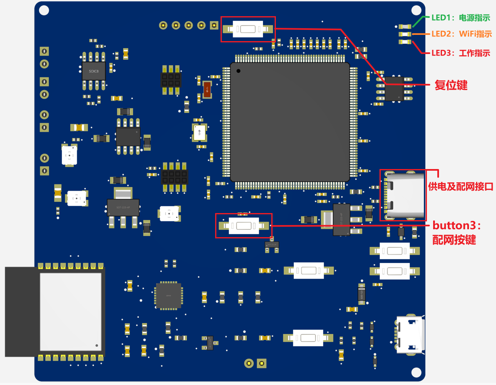
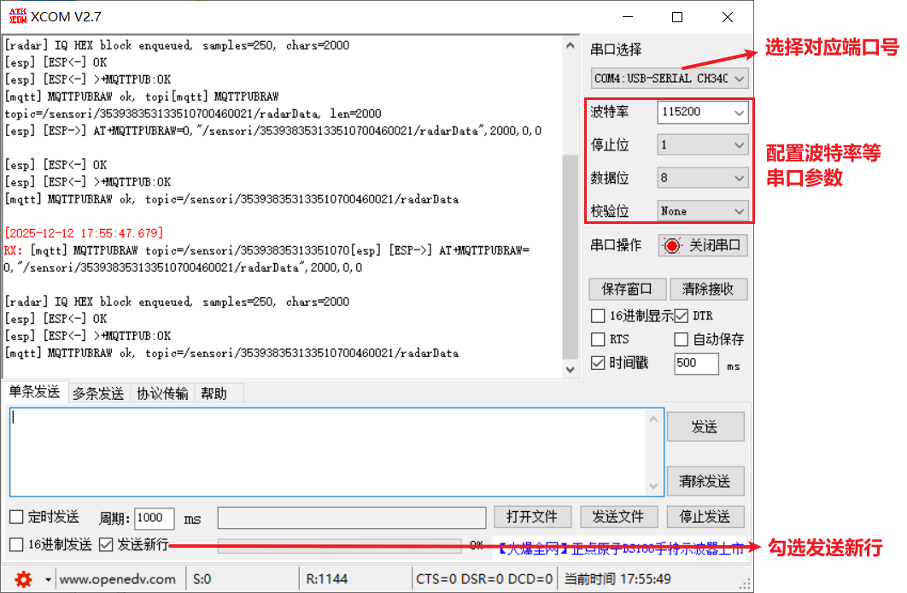
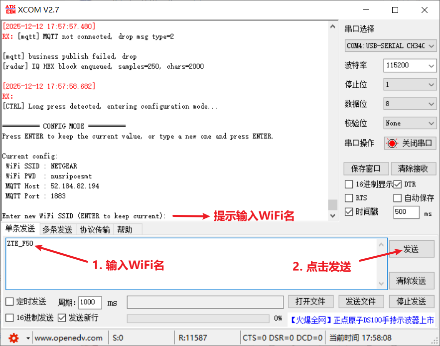
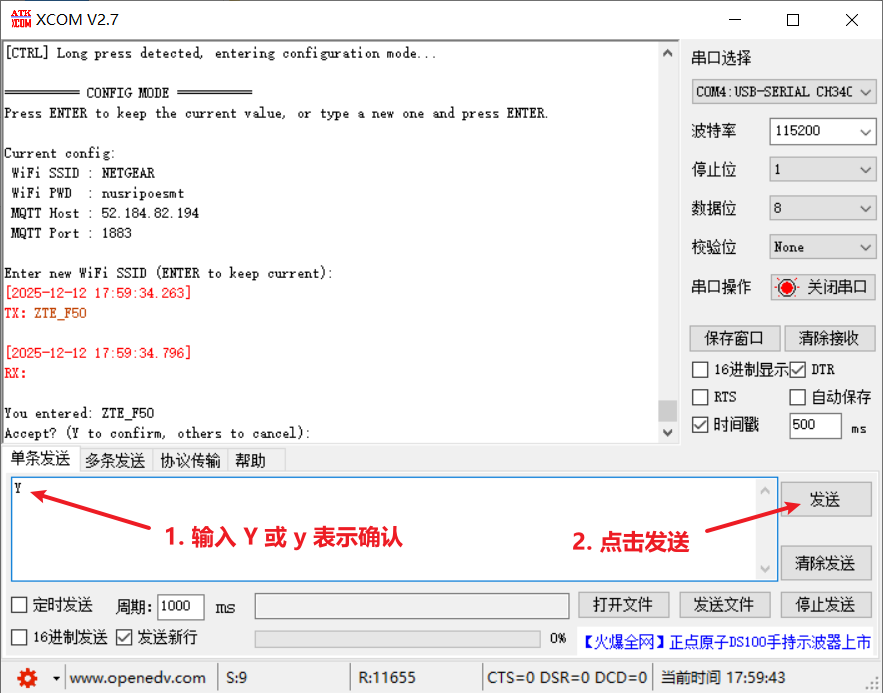
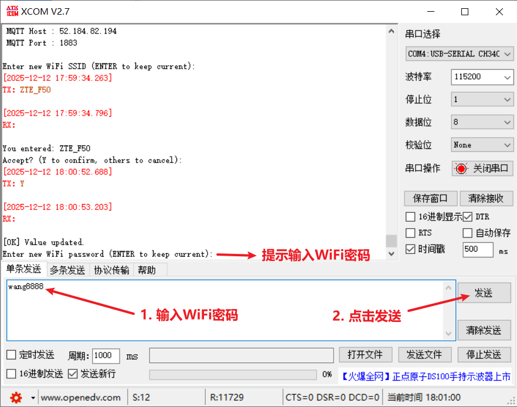
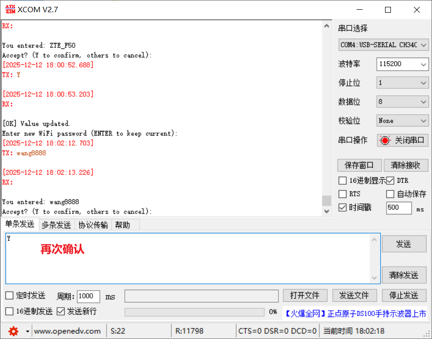
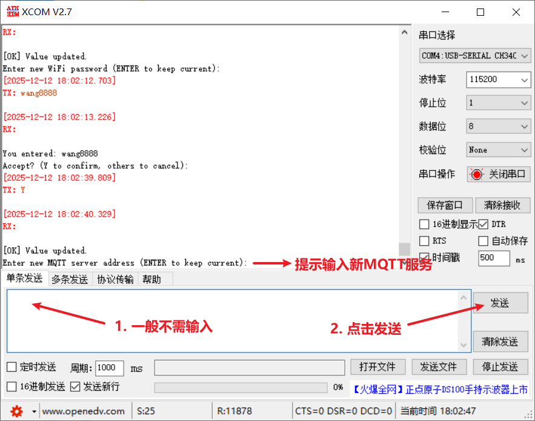
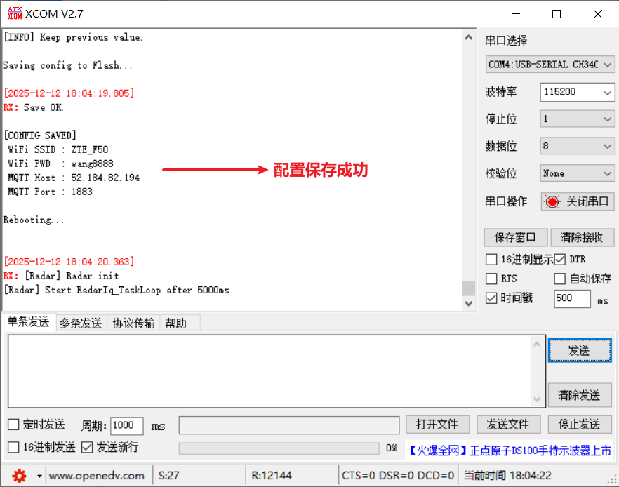
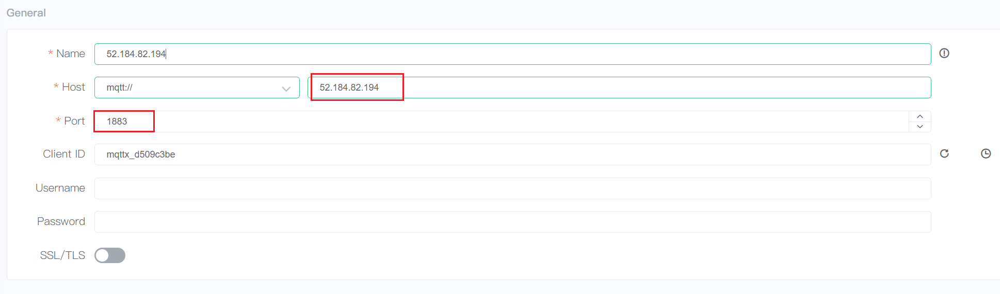
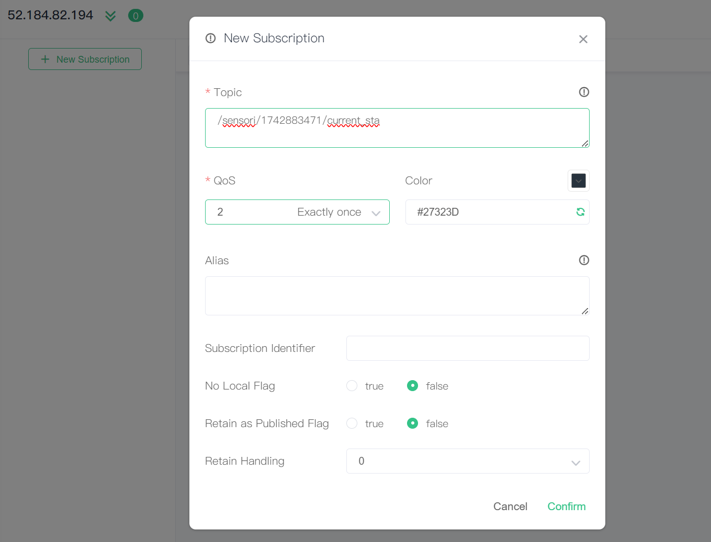

# 在床检测模块

> v2.0
> 浏览器可能会缓存旧网页，建议使用`Shift+F5`强制刷新网页，以获取最新文档。

---

## 1. 模块介绍


- **LED指示灯**：
  -  **电源指示灯**
    - 绿色，模块供电正常时常亮
  - **网络状态指示灯**
    - 黄色，WiFi连接正常时慢闪（1Hz）；WiFi连接出错时常灭；进入配网模式时快闪
  - **工作状态指示灯**
    - 红色，模块正常工作时常亮
  -  指示灯的颜色和位置可在后续工作中优化
- **复位键**
  - 按下并松开后系统重启。
- **供电及配网接口**
  - Type-c类型，要求**输入5v**（除配网以外，建议独立电源供电，电脑USB口可能供电不足）。**通电后设备自动运行**。
- **配网按键**

---

## 2. 配网流程及示意图

0）电脑上预装串口助手

1）将模块<u>供电及配网接口</u>连接至电脑

2）打开串口助手，选择对应的端口号及串口参数



3）长按配网按键，直到WiFi指示灯快闪

4）根据串口助手上的输出提示，分别发送WiFi名及密码













5）等待WiFi指示灯慢闪，表示模块已连上WiFi

​	若WiFi指示灯常灭，则摁一下模块复位键等待几秒，如若WiFi指示灯仍没有慢闪，则可能是连接的Wifi有问题，可尝试连接其他WiFi。

---

## 2. 模块的输出（主题与报文）

- 主题：`/sensori/{node_id}/current_sta`  （例如` /sensori/353938353133510700390033/result`）
- 报文（JSON）：
  - `Device`：设备号，字符串格式；
  - `Status`：状态结果，整型。
    - `0`，无人；
    - `1`，有人，处于静止状态；
    - `2`， 有人，处于运动状态。
  - `HR`：心率，浮点型，单位为`次/分钟`
  - `BR`：呼吸频率，浮点型，单位为`次/分钟`
```json
{"device_id":353938353133510700390033,"status":2,"br":0.0,"hr":0.0}
```

---

## 4. 如何获取消息

> 这里以`52.184.82.194`服务器，设备号`1742883471`为例
---

### A. 客户端软件（[MQTTX](https://mqttx.app/zh/downloads)）
- 连接52.184.82.194:1883（匿名）
  
- 订阅 `/sensori/1742883471/current_sta`主题
  

---

## 5. 常见问题
- 

---

